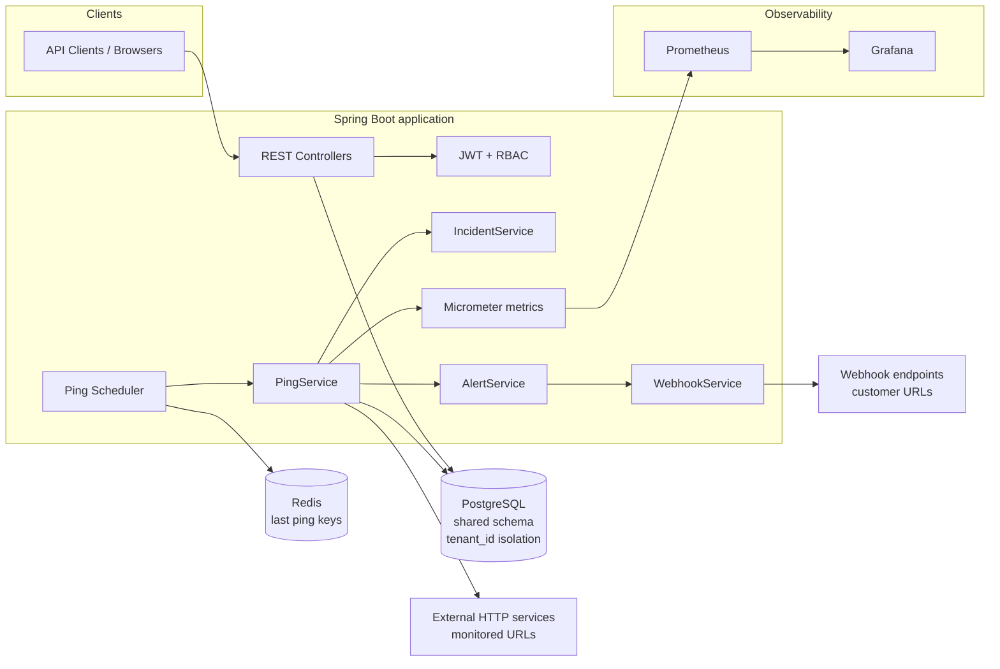
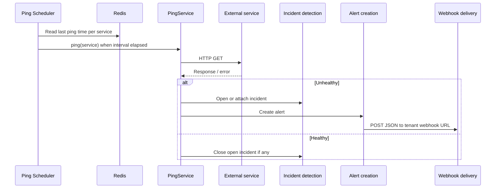
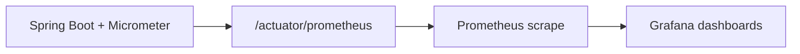

# Architecture diagram

This document summarizes how the DevOps Monitoring SaaS components interact. The runtime uses **one PostgreSQL database** with **tenant-scoped rows** (`tenant_id` on related entities): requests are authorized so users only access their tenant’s data (JWT `tenantId` + `TenantSecurity`). That is **logical multi-tenancy** in a shared schema—not separate PostgreSQL schemas per tenant.

## Mermaid (component view)



## Data flow: monitoring and alerts



## Metrics flow: App → Prometheus → Grafana



Micrometer records application metrics; Prometheus pulls from the Actuator endpoint on an interval; Grafana uses Prometheus as a datasource to visualize business and operational metrics.

## ASCII overview

```
                    +------------------+
                    |   API clients    |
                    +--------+---------+
                             |
                             v
+----------------+    +------+------+     +-------------+
|   PostgreSQL   |<---| Spring Boot |---->|    Redis    |
| (tenant rows)  |    | JWT / RBAC  |     | ping timing |
+----------------+    +------+------+     +-------------+
                             |
         +-------------------+-------------------+
         |                   |                   |
         v                   v                   v
 +---------------+   +---------------+   +---------------+
 | Ping scheduler|   | External HTTP |   | Webhook URLs  |
 |  (scheduled)  |   |  (monitored)  |   |  (customer)   |
 +---------------+   +---------------+   +---------------+
                             |
                    Micrometer /actuator/prometheus
                             |
                             v
                    +--------+---------+
                    |    Prometheus    |
                    +--------+---------+
                             |
                             v
                    +--------+---------+
                    |     Grafana      |
                    +------------------+
```

## Multi-tenancy (brief)

- Each **tenant** has its own users, services, incidents, and alerts in the same database; foreign keys and queries are scoped by `tenant_id`.
- After login, the **JWT** includes `tenantId` and `role`; controllers use `@PreAuthorize` and `TenantSecurity.sameTenant(...)` so paths like `/tenants/{tenantId}/...` cannot be used to access another tenant’s data.
